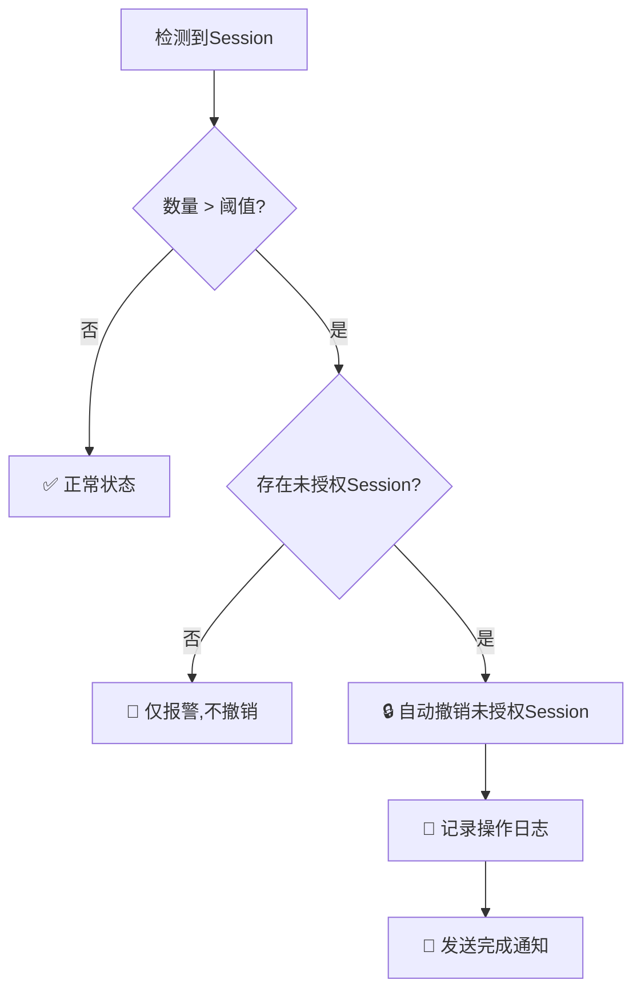

# 🛡️ Cursor Session 监测系统

> **企业级账户安全保护工具**  
> 智能监测 • 自动撤销 • 实时报警 • 安全防护

一个功能强大的Cursor账户session监测系统，具有**自动撤销未授权session**的核心功能，为你的账户安全提供7×24小时的守护。

---

## 📋 目录

- [⚡ 快速开始](#-快速开始)
- [🔒 安全警告](#-安全警告)
- [✨ 核心功能](#-核心功能)
- [📦 系统组成](#-系统组成)
- [🚀 使用方法](#-使用方法)
- [⚙️ 配置说明](#-配置说明)
- [📊 示例输出](#-示例输出)
- [🔧 故障排除](#-故障排除)
- [📝 更新维护](#-更新维护)
- [❓ 常见问题](#-常见问题)

---

## ⚡ 快速开始

### 🎯 一分钟上手

```bash
# 1. 执行一次监测（默认阈值2）
python3 workflows/cursor_session_monitor.py

# 2. 设置定时监测（每10分钟检查一次）
python3 workflows/cursor_session_scheduler.py interval 10

# 3. 查看帮助
python3 workflows/cursor_session_scheduler.py
```

### 📋 使用前检查清单

- [ ] ✅ 系统安装Python 3.6+
- [ ] ✅ 确认网络可访问cursor.com
- [ ] ✅ 检查cookies配置是否正确
- [ ] ✅ **重要**: 确认白名单session配置正确
- [ ] ✅ 建议首次使用高阈值(如10)进行测试

---

## 🔒 安全警告

> ⚠️ **极其重要**: 此系统具有自动撤销session的能力，使用不当可能导致重要设备断线！

### 🚨 关键风险

| 风险等级 | 描述 | 影响 |
|---------|------|------|
| 🔴 **高危** | 误删授权session | 导致正常设备被强制下线 |
| 🟡 **中等** | 阈值设置过低 | 频繁误报和误删 |
| 🟢 **低危** | Cookie过期 | 监测功能失效 |

### 🛡️ 安全建议

1. **首次使用**: 阈值设为10，观察1-2天
2. **白名单检查**: 确保所有重要设备session都在白名单中
3. **定期检查**: 每周检查一次系统日志
4. **备份重要**: 记录关键session ID

---

## ✨ 核心功能

### 🎯 主要特性

| 功能 | 描述 | 状态 |
|------|------|------|
| 🔍 **实时监测** | 24/7监控活跃session数量 | ✅ 已实现 |
| 🤖 **智能识别** | 自动区分授权/未授权session | ✅ 已实现 |
| 🔒 **自动撤销** | 超阈值时自动清理未授权session | ✅ 已实现 |
| 🛡️ **白名单保护** | 永不撤销指定的授权session | ✅ 已实现 |
| 📱 **桌面通知** | macOS原生通知支持 | ✅ 已实现 |
| 📝 **详细日志** | 完整记录所有操作和结果 | ✅ 已实现 |
| ⏰ **定时任务** | 支持间隔监测和crontab集成 | ✅ 已实现 |

### 🎛️ 智能撤销逻辑



---

## 📦 系统组成

### 🧩 文件结构

```
workflows/
├── cursor_session_monitor.py    # 🎯 核心监测引擎
├── cursor_session_scheduler.py  # ⏰ 定时任务调度器
├── README_cursor_monitor.md     # 📖 使用说明文档
└── logs/
    └── cursor_session_alerts.log # 📋 操作日志文件
```

### 📦 组件说明

| 组件 | 功能描述 | 主要特性 |
|------|----------|----------|
| **🎯 核心监测引擎** | `cursor_session_monitor.py` | • 实时session监测<br>• 智能白名单识别<br>• 自动撤销未授权session<br>• 桌面通知报警 |
| **⏰ 定时调度器** | `cursor_session_scheduler.py` | • 间隔监测任务<br>• Crontab集成<br>• 一次性检查<br>• 后台运行支持 |
| **📋 日志系统** | `logs/cursor_session_alerts.log` | • 详细操作记录<br>• 撤销结果追踪<br>• 时间戳标记<br>• 自动创建目录 |

### 📊 监测信息结构

每个session包含以下关键信息：

| 字段 | 类型 | 说明 | 示例 |
|------|------|------|------|
| `sessionId` | String | 会话唯一标识符 | `bef44cb7a943c9e...` |
| `type` | Enum | 会话类型 | `SESSION_TYPE_WEB` / `SESSION_TYPE_CLIENT` |
| `createdAt` | DateTime | 创建时间 | `2025-07-24T01:44:19.000Z` |
| `expiresAt` | DateTime | 过期时间 | `2025-09-22T01:44:19.000Z` |

### 🔒 当前白名单配置

> **重要**: 以下session永远不会被自动撤销

| 设备类型 | Session ID | 备注 |
|----------|------------|------|
| CLIENT | `bef44cb7a943c9ebe9c1a770e3607a0755fec16743ebdd4d7846083bb0b80b2e` | 主要客户端 |
| WEB | `25555cc17973482b42fa112a896973a3e49dfe3f494fd5a9037e72f105a0b4a9` | 主要浏览器 |

---

## 🚀 使用方法

### 📋 命令速查表

| 使用场景 | 命令 | 说明 |
|----------|------|------|
| 🔍 **单次检查** | `python3 workflows/cursor_session_monitor.py` | 使用默认阈值2 |
| 🎯 **自定义阈值** | `python3 workflows/cursor_session_monitor.py 5` | 阈值设为5 |
| ⏰ **间隔监测** | `python3 workflows/cursor_session_scheduler.py interval 10` | 每10分钟检查 |
| 📅 **生成定时任务** | `python3 workflows/cursor_session_scheduler.py crontab "*/5 * * * *"` | 每5分钟执行 |
| ❓ **查看帮助** | `python3 workflows/cursor_session_scheduler.py` | 显示使用说明 |

### 🎯 基本监测

```bash
# 快速检查当前状态（推荐新手）
python3 workflows/cursor_session_monitor.py

# 自定义报警阈值
python3 workflows/cursor_session_monitor.py 3    # 阈值设为3
python3 workflows/cursor_session_monitor.py 5    # 阈值设为5（适合多设备用户）
```

### ⏰ 定时监测

```bash
# 前台间隔监测（适合调试）
python3 workflows/cursor_session_scheduler.py interval 5      # 每5分钟
python3 workflows/cursor_session_scheduler.py interval 10 3   # 每10分钟，阈值3

# 通过调度器执行单次检查
python3 workflows/cursor_session_scheduler.py run 2
```

### 📅 系统定时任务

#### 🔧 生成Crontab条目

```bash
# 常用场景
python3 workflows/cursor_session_scheduler.py crontab "*/5 * * * *"    # 每5分钟
python3 workflows/cursor_session_scheduler.py crontab "0 * * * *"      # 每小时
python3 workflows/cursor_session_scheduler.py crontab "0 9-18 * * 1-5" # 工作时间
```

#### ⏰ 常用Cron表达式

| 频率 | 表达式 | 说明 | 适用场景 |
|------|--------|------|----------|
| `*/5 * * * *` | 每5分钟 | 🔥 高频监控 | 高安全要求 |
| `*/10 * * * *` | 每10分钟 | ⭐ 推荐 | 平衡性能和安全 |
| `0 * * * *` | 每小时 | 💡 轻量级 | 低频检查 |
| `0 9-18 * * 1-5` | 工作时间 | 🏢 办公场景 | 仅工作日监控 |
| `0 0 * * *` | 每天午夜 | 🌙 每日检查 | 基础安全 |

#### 🛠️ 安装到系统

```bash
# 1. 生成crontab条目
python3 workflows/cursor_session_scheduler.py crontab "*/10 * * * *"

# 2. 编辑crontab
crontab -e

# 3. 粘贴生成的条目并保存

# 4. 验证crontab是否生效
crontab -l
```

---

## ⚙️ 配置说明

### 🔑 认证配置

系统使用以下cookies进行API认证：

| Cookie名称 | 用途 | 重要性 |
|------------|------|--------|
| `_dd_s` | DataDog会话追踪 | 🟡 中等 |
| `IndrX2Zu...` | 用户身份标识 | 🔴 高 |
| `ph_phc_...` | PostHog分析追踪 | 🟢 低 |
| `WorkosCursorSessionToken` | **主要认证令牌** | 🔴 极高 |

> ⚠️ **重要**: `WorkosCursorSessionToken` 是系统认证的核心，如果过期将导致所有功能失效

### 🛡️ 白名单管理

#### 当前配置

```python
# 在 cursor_session_monitor.py 中修改
self.authorized_sessions = {
    'bef44cb7a943c9ebe9c1a770e3607a0755fec16743ebdd4d7846083bb0b80b2e',  # 主要客户端
    '25555cc17973482b42fa112a896973a3e49dfe3f494fd5a9037e72f105a0b4a9'   # 主要浏览器
}
```

#### 🔧 修改白名单

1. **查看当前sessions**：
   ```bash
   python3 workflows/cursor_session_monitor.py 10  # 高阈值避免误删
   ```

2. **编辑配置文件**：
   ```bash
   vim workflows/cursor_session_monitor.py  # 修改 authorized_sessions
   ```

3. **验证配置**：
   ```bash
   python3 workflows/cursor_session_monitor.py  # 测试运行
   ```

### 📊 阈值配置指南

| 使用场景 | 建议阈值 | 说明 |
|----------|----------|------|
| 🖥️ **单设备用户** | 1-2 | 只使用一台电脑 |
| 🏢 **多设备办公** | 3-5 | 办公室+家里+移动设备 |
| 👥 **团队共享** | 5-10 | 多人使用同一账号 |
| 🧪 **测试环境** | 10+ | 避免误删，观察模式 |

### 🔌 API接口配置

| 接口 | 地址 | 方法 | 用途 |
|------|------|------|------|
| **获取Sessions** | `https://cursor.com/api/auth/sessions` | GET | 查询活跃会话 |
| **撤销Session** | `https://cursor.com/api/auth/sessions/revoke` | POST | 删除指定会话 |

#### 撤销请求格式

```json
{
  "session_id": "会话ID字符串",
  "type": 1  // 1=WEB, 2=CLIENT
}
```

### 📝 日志配置

| 配置项 | 值 | 说明 |
|--------|-----|------|
| **路径** | `logs/cursor_session_alerts.log` | 相对于脚本目录 |
| **编码** | UTF-8 | 支持中文 |
| **轮转** | 手动 | 需要手动清理 |
| **权限** | 644 | 读写权限 |

#### 日志格式示例

```
================================================================================
报警时间: 2025-07-30 14:30:09
会话数量: 3
阈值: 2
授权会话数量: 2
详细信息:
[会话详细信息...]

🔒 自动撤销操作记录:
  撤销 1: 9acd6d38c51b4f8c... ✅ 成功
================================================================================
```

---

## 📊 示例输出

### ✅ 正常情况

```bash
$ python3 workflows/cursor_session_monitor.py

开始监测cursor会话 (报警阈值: 2)
授权会话白名单: 2 个
[2025-07-30 14:29:59] 正在获取cursor活跃sessions...
请求状态码: 200

当前活跃会话数量: 2
详细信息:
发现 2 个活跃会话:
------------------------------------------------------------
✅ 授权会话 (2个):
  会话 1:
    sessionId: 25555cc17973482b42fa112a896973a3e49dfe3f494fd5a9037e72f105a0b4a9
    type: SESSION_TYPE_WEB
    createdAt: 2025-07-24T01:44:19.000Z
    expiresAt: 2025-09-22T01:44:19.000Z

  会话 2:
    sessionId: bef44cb7a943c9ebe9c1a770e3607a0755fec16743ebdd4d7846083bb0b80b2e
    type: SESSION_TYPE_CLIENT
    createdAt: 2025-07-24T01:53:29.000Z
    expiresAt: 2025-09-22T01:53:29.000Z

📊 会话分析:
  授权会话: 2 个
  未授权会话: 0 个
✅ 会话数量正常 (2 <= 2)
```

### 🚨 报警并自动撤销

```bash
$ python3 workflows/cursor_session_monitor.py

当前活跃会话数量: 3
📊 会话分析:
  授权会话: 2 个
  未授权会话: 1 个

🚨 检测到异常情况！
当前有 3 个活跃会话，超过阈值 2!
发现 1 个未授权会话，开始自动撤销...

🔒 正在撤销未授权会话: 9acd6d38c51b4f8c...
📡 调用API: POST https://cursor.com/api/auth/sessions/revoke
📤 发送数据: {"session_id":"9acd6d38c51b4f8c...","type":1}
📥 撤销请求状态码: 200
✅ 成功撤销session: 9acd6d38c51b4f8c...

🎯 自动撤销完成!
成功撤销: 1/1 个未授权会话
✅ 所有未授权会话已成功清理
📝 详细信息已记录到: logs/cursor_session_alerts.log
```

### 🔧 定时监测输出

```bash
$ python3 workflows/cursor_session_scheduler.py interval 10

开始定时监测 (间隔: 10分钟, 阈值: 2)
📱 包含自动撤销未授权session功能
按 Ctrl+C 停止监测

[2025-07-30 14:30:00] 执行监测命令: python3 cursor_session_monitor.py 2
监测结果:
[正常监测输出...]

[2025-07-30 14:40:00] 执行监测命令: python3 cursor_session_monitor.py 2
监测结果:
[正常监测输出...]
```

---

## 🔧 故障排除

### 🚨 常见问题诊断

| 错误类型 | 症状 | 解决方案 |
|----------|------|----------|
| 🐍 **Python版本** | `SyntaxError: invalid syntax` | 使用`python3`而不是`python` |
| 🌐 **网络问题** | `请求异常: Connection timeout` | 检查网络连接和防火墙设置 |
| 🔐 **认证失败** | `HTTP错误: 401/403` | 更新cookies配置 |
| 📁 **权限问题** | `记录日志失败: Permission denied` | 检查文件夹写权限 |
| 🔕 **通知不显示** | 没有桌面通知 | 检查macOS通知权限 |

### 🛠️ 调试步骤

#### 1. 基础环境检查
```bash
# 检查Python版本
python3 --version  # 应该是3.6+

# 检查网络连接
curl -I https://cursor.com/api/auth/sessions

# 检查文件权限
ls -la workflows/
```

#### 2. 详细日志分析
```bash
# 查看最近的日志
tail -50 logs/cursor_session_alerts.log

# 实时监控日志
tail -f logs/cursor_session_alerts.log
```

#### 3. API调试模式
```bash
# 开启详细输出进行调试
python3 workflows/cursor_session_monitor.py 10  # 高阈值避免误删
```

### 🔍 错误代码对照

| HTTP状态码 | 含义 | 处理方法 |
|------------|------|----------|
| 200 | ✅ 成功 | 正常运行 |
| 401 | 🔐 未授权 | 更新cookies |
| 403 | 🚫 禁止访问 | 检查账号权限 |
| 429 | ⏰ 请求过频 | 增加监测间隔 |
| 500 | 🔥 服务器错误 | 等待服务恢复 |

---

## 📝 更新维护

### 🔄 定期维护任务

| 任务 | 频率 | 重要性 |
|------|------|--------|
| 检查cookies有效性 | 每周 | 🔴 高 |
| 清理日志文件 | 每月 | 🟡 中 |
| 验证白名单准确性 | 每月 | 🔴 高 |
| 检查系统运行状态 | 每周 | 🟡 中 |

### 🔐 Cookie更新指南

当收到认证失败错误时，按以下步骤更新：

#### 1. 获取新Cookies
```bash
# 1. 打开Chrome/Safari开发者工具 (F12)
# 2. 访问 https://cursor.com
# 3. 登录账号
# 4. 在Network面板找到API请求
# 5. 复制Request Headers中的Cookie值
```

#### 2. 更新配置
```python
# 编辑 cursor_session_monitor.py
self.cookies = {
    '_dd_s': '新的_dd_s值',
    'IndrX2Zu...': '新的用户ID值', 
    'ph_phc_...': '新的PostHog值',
    'WorkosCursorSessionToken': '新的Session Token'
}
```

#### 3. 验证更新
```bash
python3 workflows/cursor_session_monitor.py 10  # 测试新cookies
```

### 🛡️ 白名单管理

#### 添加新的授权Session
```bash
# 1. 查看当前所有sessions
python3 workflows/cursor_session_monitor.py 20

# 2. 识别需要保护的session ID
# 3. 编辑脚本添加到authorized_sessions集合
# 4. 测试验证
python3 workflows/cursor_session_monitor.py
```

#### 移除失效Session
```bash
# 定期清理白名单中已过期的session
# 查看session的expiresAt字段，手动移除过期项
```

---

## ❓ 常见问题

### 🤔 功能相关

<details>
<summary><strong>Q: 自动撤销功能会误删重要session吗？</strong></summary>

A: 不会。系统有白名单保护机制：
- 白名单中的session永远不会被撤销
- 只有同时满足"超过阈值"和"存在未授权session"时才会执行撤销
- 建议首次使用时设置高阈值（如10）进行观察
</details>

<details>
<summary><strong>Q: 为什么有时候通知不显示？</strong></summary>

A: 可能的原因：
- macOS通知权限未开启
- 系统勿扰模式已开启
- 终端应用没有通知权限

解决方法：系统偏好设置 → 通知 → 终端 → 允许通知
</details>

<details>
<summary><strong>Q: 可以在Linux/Windows上使用吗？</strong></summary>

A: 核心功能支持，但通知功能需要修改：
- 监测和撤销功能跨平台兼容
- 桌面通知需要替换为对应系统的命令
- 建议在macOS上使用以获得最佳体验
</details>

### 🔧 技术问题

<details>
<summary><strong>Q: 如何调整监测频率？</strong></summary>

A: 多种方式可选：
```bash
# 间隔监测（前台运行）
python3 workflows/cursor_session_scheduler.py interval 5  # 每5分钟

# Crontab定时任务（后台运行）
python3 workflows/cursor_session_scheduler.py crontab "*/10 * * * *"  # 每10分钟
```
</details>

<details>
<summary><strong>Q: 日志文件太大怎么办？</strong></summary>

A: 定期清理日志：
```bash
# 备份重要日志
cp logs/cursor_session_alerts.log logs/backup_$(date +%Y%m%d).log

# 清空当前日志
> logs/cursor_session_alerts.log

# 或者删除旧日志重新开始
rm logs/cursor_session_alerts.log
```
</details>

<details>
<summary><strong>Q: 如何暂时禁用自动撤销？</strong></summary>

A: 设置极高阈值：
```bash
python3 workflows/cursor_session_monitor.py 999  # 阈值设为999
```
或注释掉撤销代码部分，只保留监测和报警功能。
</details>

### 🛡️ 安全问题

<details>
<summary><strong>Q: 这个系统安全吗？</strong></summary>

A: 相对安全，但需要注意：
- ✅ 使用官方API，不涉及密码破解
- ✅ 白名单保护防止误删
- ✅ 详细日志记录所有操作
- ⚠️ Cookies需要妥善保管
- ⚠️ 定期检查白名单准确性
</details>

<details>
<summary><strong>Q: 如何保护敏感信息？</strong></summary>

A: 系统内置保护措施：
- Session ID在显示时自动截断
- 日志文件包含完整信息但访问受限
- 建议将脚本放在受保护的目录中
</details>

---

## 📖 技术文档

### 🔌 API接口规范

#### 获取Sessions接口
```
GET https://cursor.com/api/auth/sessions
Headers: Cookie: [认证cookies]
Response: {
  "sessions": [
    {
      "sessionId": "string",
      "type": "SESSION_TYPE_WEB|SESSION_TYPE_CLIENT", 
      "createdAt": "ISO8601_datetime",
      "expiresAt": "ISO8601_datetime"
    }
  ]
}
```

#### 撤销Session接口
```
POST https://cursor.com/api/auth/sessions/revoke
Headers: 
  Cookie: [认证cookies]
  Content-Type: application/json
Body: {
  "session_id": "要撤销的session ID",
  "type": 1  // 1=WEB, 2=CLIENT
}
Response: HTTP 200 表示成功
```

### 📊 系统架构

```
用户 → 定时调度器 → 核心监测引擎 → Cursor API
                ↓                    ↓
              日志系统 ← 桌面通知 ← 报警系统
```

---

## 🎯 版本信息

- **当前版本**: v2.0 增强版
- **最后更新**: 2025-07-30
- **兼容性**: Python 3.6+, macOS 10.14+
- **许可证**: MIT License

### 🔄 更新日志

- **v2.0** (2025-07-30): 新增自动撤销功能，白名单保护，智能识别
- **v1.0** (2025-07-24): 基础监测功能，桌面通知，日志记录

---

> 💡 **提示**: 如果你遇到任何问题或需要帮助，请检查日志文件并参考上述故障排除指南。保持系统更新以获得最佳安全保护效果！